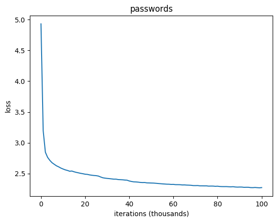

<h3 align="center">
  
</h3>

# Password Cracker
Character-level **RNN** (Recurrent Neural Net) **LSTM** (Long Short-Term Memory) text predictor intended for password generation research.

## Disclaimer
This project was developed for purely educational use. Don't use it for any evil purposes.

## Idea
1. Given a large dataset of leaked passwords.
2. Train a **RNN LSTM** model on it.
3. Generate new passwords.

## Data
[Top 85 millions WPA (Wi-Fi) Passwords](https://github.com/berzerk0/Probable-Wordlists/tree/master/Real-Passwords/WPA-Length)

Randomized and split into:

* **Training set (10%)** ~100 MB (9 M passwords)
* **Testing set (90%)** ~850 MB (76 M passwords)

## Implementation
[**Text Predictor RNN LSTM**](https://github.com/gsurma/text_predictor), for more details check this [article](https://towardsdatascience.com/text-predictor-generating-rap-lyrics-with-recurrent-neural-networks-lstms-c3a1acbbda79). 

## Hyperparameters
	Batch size: 32
	Sequence length: 25
	Learning rate: 0.002
	Decay rate: 0.97
	Hidden layer size: 1024
	Cells size: 3

## Results

`hit_ratio = sampled_passwords_in_test_set / all_sampled_passwords`

After 100 thousands of learning iterations, RNN LSTM model generated **896** passwords and **119** of them were in the validation set. 

It means that **13%** of the generated password were *cracked*.

Examples of AI generated passwords that were actually used by people:

	richardmars
	sierrasoftball
	8aug1863
	FalconGroovy
	verstockt
	hakensen
	mccaitlin
	playboyslayer
	republicmaster
	eddie123
	Denversharon
	marchand
	humaniseront5
	7december1789
	15071600
	Spatted2
	jaredhomebrew
	choco2007
	doctorPacker
	bac7er!o1o9!s7s
	elliot1993
	d3r!v@7!on
	trickset
	jonathancruise
	mcjordan23
	Family82
	susanAwesome